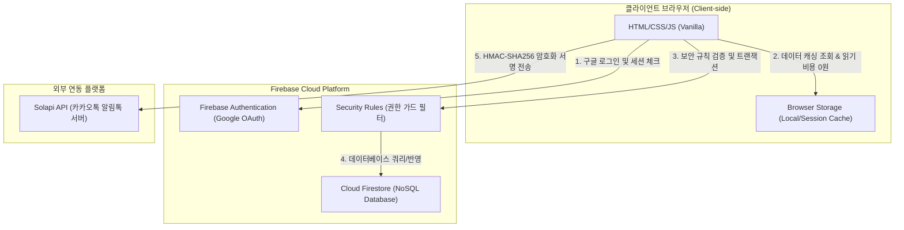
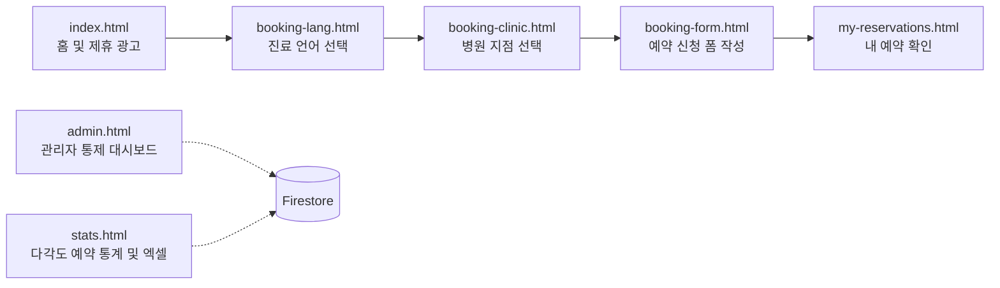
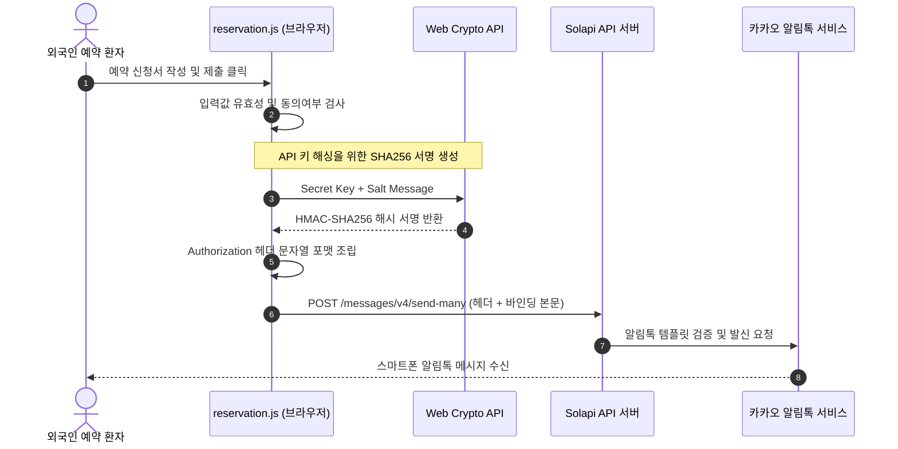
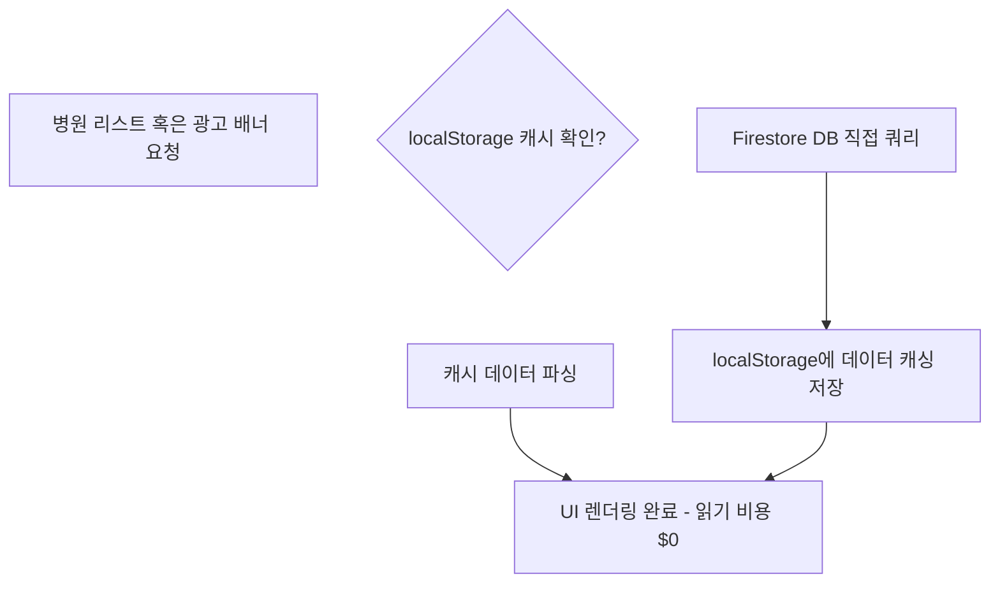

# IGPartners 글로벌 의료 매칭 예약 시스템 상세 사양 및 분석 명세서

본 문서는 `IGPartners` 웹 기반 글로벌 의료 매칭 예약 대행 시스템의 전체 코드베이스를 정밀 분석하여 작성된 시스템 분석 및 사양 명세서입니다. 본 시스템을 이용 및 운영하는 클라이언트사의 시스템 이해도를 증진시키고, 향후 원활한 유지보수 및 확장을 지원하는 것을 목적으로 합니다.

---

## 1. 시스템 아키텍처 및 서버 무료화 설계 (Serverless Architecture)

본 시스템은 인프라 운영 비용을 영구적으로 \(0\)원에 수렴시키기 위해 **서버리스(Serverless)** 및 **클라이언트 사이드 렌더링(CSR)** 아키텍처를 전적으로 채택하였습니다. 

### 1.1 비용 0원 유지 메커니즘 (Firebase Spark Plan 최적화)
- **정적 호스팅 (Static Hosting)**: 어플리케이션은 HTML, CSS, Vanilla JS로만 구성되어 있어 별도의 Node.js, Spring 등의 상시 가동 WAS(Web Application Server) 구동 비용이 발생하지 않습니다. Firebase Hosting의 무료 한도(10GB 스토리지, 일일 360MB 전송량) 내에서 영구 무료로 배포할 수 있습니다.
- **클라이언트 측 캐싱 (Client-Side Caching)**: Firestore DB 호출은 사용량당 과금(Spark Plan 무료 한도: 일일 쓰기 2만 회, 읽기 5만 회)되므로, 시스템은 브라우저의 `localStorage` 및 `sessionStorage`를 활용하여 병원 목록과 로그인 권한 정보를 1차 캐싱합니다. 이를 통해 반복적인 페이지 이동 시 Firestore 호출 비용을 **\(0\)회**로 차단합니다.
- **CDN 기반 SDK 로드**: Firebase App, Auth, Firestore SDK를 별도 빌드 단계 없이 Google CDN을 통해 다이렉트로 로드하여 브라우저 로딩 속도를 높이고 서버 저장 공간을 절약합니다.

### 1.2 전체 시스템 아키텍처 구성도



---

## 2. 디자인 시스템 및 UI/UX 스타일 가이드

`style.css`에 기반한 본 시스템의 디자인은 미래지향적이고 고급스러운 **다크 테마 글래스모피즘(Dark Theme Glassmorphism)**을 표방합니다.

### 2.1 디자인 토큰 (Design Tokens) 명세
시스템 전체의 스타일 일관성을 보장하기 위해 정의된 주요 전역 CSS 변수는 다음과 같습니다:

| CSS 변수명 | 설정 값 | 용도 및 시각적 역할 |
| :--- | :--- | :--- |
| `--bg-main` | `#060913` | 전체 화면의 기본 배경색 (딥 네이비) |
| `--bg-surface` | `#0c1020` | 카드, 모달, 입력 폼 등 컨텐츠가 얹어지는 박스의 표면색 |
| `--bg-glow` | `rgba(99, 102, 241, 0.12)` | 백그라운드에서 은은하게 퍼지는 오로라 조명 효과 광원색 |
| `--text-primary` | `#f3f4f6` | 헤드라인, 굵은 텍스트 등 핵심 정보 표시용 고대비 문자색 |
| `--text-secondary` | `#9ca3af` | 힌트, 레이블 설명, 보조 텍스트용 연회색 문자색 |
| `--accent-blue` | `#3b82f6` | 진료 정보, 포인트 버튼 등 강조용 블루 컬러 |
| `--accent-indigo` | `#6366f1` | 브랜드 기본 아이덴티티 및 핵심 그라데이션 포인트 컬러 |
| `--accent-purple` | `#8b5cf6` | 보조 액션 버튼 및 세련된 연출용 퍼플 컬러 |
| `--glass-bg` | `rgba(255, 255, 255, 0.02)` | 유리 느낌을 주는 반투명 글래스 컨테이너 배경 배경색 |
| `--glass-border` | `rgba(255, 255, 255, 0.06)` | 글래스모피즘 컨테이너의 아주 미세하고 은은한 외곽 경계선 |
| `--glass-border-hover`| `rgba(99, 102, 241, 0.4)` | 카드 요소 등에 마우스 호버 시 포인트 라인이 반짝이도록 제어 |
| `--transition-smooth` | `all 0.4s cubic-bezier(0.16, 1, 0.3, 1)` | 마우스 오버 및 활성화 모션에 부드러움을 극대화하는 베지에 트랜지션 |

### 2.2 반응형 레이아웃 및 UX 제어
본 시스템은 데스크톱 모드(PC)와 모바일 모드(Mobile/Tablet) 간의 유연한 화면 변환을 위해 미디어 쿼리(CSS Breakpoint: `1024px`)와 Javascript의 실시간 크기 감지(`resize` 이벤트)를 조합하여 제공합니다.

- **데스크톱 화면 (Width > 1024px)**: 상단 네비게이션 우측 영역에 사용자 계정 캡슐(프로필 사진 + 닉네임)과 예약 확인(📅), 관리자(👑) 버튼이 가로 배치됩니다.
- **모바일 화면 (Width <= 1024px)**:
  - 데스크톱 인증 영역이 DOM 트리 내에서 모바일 햄버거 서랍장 메뉴 최하단으로 **동적 병합 및 이동** 처리되어 터치 편의성을 보장합니다.
  - 화면 하단에 퀵 액션 바로가기 네비게이션 바가 고정 활성화되어 모바일 앱처럼 쾌적하게 탭 메뉴를 오갈 수 있습니다.

---

## 3. 페이지별 기능 명세 및 프론트엔드 비즈니스 로직

`igpartners` 시스템의 프론트엔드는 총 8개의 HTML 페이지와 이와 연동된 개별 Javascript 파일들로 세분화됩니다. 각 구성요소의 비즈니스 로직 동작 방식은 다음과 같습니다.

### 3.1 페이지별 프론트엔드 구현 및 상세 사양



| 페이지 파일명 | 바인딩 스크립트 | 핵심 구현 기능 및 코딩 방식 |
| :--- | :--- | :--- |
| **`index.html`**<br>(메인 홈) | `navigation.js`<br>`auth.js`<br>`ad-slider.js` | - 히어로 웅장한 예약 버튼 배치 및 공통 헤더/푸터 동적 주입<br>- `ads` 컬렉션의 광고 데이터를 로드하고 각 광고 카드별 개별 이미지 롤링 타이머 구동<br>- DB에 저장된 제휴 정보가 비어 있을 시 8개의 고화질 웰니스 샘플 광고를 노출하는 Fallback 시스템 작동 |
| **`about.html`**<br>(회사 소개) | `navigation.js`<br>`auth.js` | - 아이지파트너스의 국내 최초 글로벌 헬스케어 게이트웨이 서비스 소개 및 비전 명시<br>- 제공 서비스 섹션(`#services`)을 포함하여 의료 통역 및 지점 매칭 비즈니스 핵심 강점 명시 |
| **`booking-lang.html`**<br>(예약 언어 선택) | `navigation.js`<br>`auth.js` | - 예약자가 가장 편하게 의사소통할 수 있는 언어(한국어, 베트남어 등 15개국어)를 선택하는 게이트웨이<br>- 선택된 언어 키(`selected_lang`)를 브라우저 `localStorage`에 즉시 기록하여 후속 페이지들의 모든 UI 텍스트 언어팩을 자동 스위칭함 |
| **`booking-clinic.html`**<br>(진료 병원 선택) | `navigation.js`<br>`auth.js`<br>`clinic-loader.js` | - 지정된 다국어 키를 바탕으로 병원 소개, 진료과목 배지, 주소를 맞춤 번역 노출<br>- 병원 주소 클릭 시 Google Maps 검색 링크를 연동하여 지도로 위치 확인 제공<br>- 로그인 세션이 확인되지 않는 비로그인 유저가 예약을 신청하려 할 때, 경고창 대신 로그인 필수 모달을 활성화하여 UX 이탈률 최소화 |
| **`booking-form.html`**<br>(예약 정보 입력) | `navigation.js`<br>`auth.js`<br>`reservation.js` | - 여권 성명, 성별, 비자 타입, 생년월일, 희망일, 주소, 연락처, 주요 임상 증상 등 필수 정보 입력 폼 제공<br>- 개인정보 처리방침 동의 체크 검증 및 모달을 통한 세부 약관 노출<br>- 중복 제출을 막기 위해 폼 전송 시작 시 제출 버튼을 비활성화(`disabled`)하고 "처리 중..." 텍스트 노출 |
| **`my-reservations.html`**<br>(내 예약 확인) | `navigation.js`<br>`auth.js`<br>`my-reservations.js` | - 로그인된 본인의 UID와 일치하는 예약 데이터만 실시간 조회(Firestore 실시간 수신 대기 및 정렬)<br>- 예약 상태(`pending` 대기, `confirmed` 확정, `cancelled` 취소)별 실시간 뱃지 상태 업데이트 반영 |
| **`admin.html`**<br>(관리자용 페이지) | `navigation.js`<br>`auth.js`<br>`admin.js` | - **대규모 관리 기능 통합**: 예약 목록, 회원 리스트, 병원 정보, 등급별 접근 권한, 광고 배너 관리의 5개 영역 제어<br>- 관리자가 예약 내역을 확인하고 수동으로 유입경로(`inflow`) 데이터를 직접 타이핑 및 즉시 업데이트하는 인라인 input UI 지원<br>- 회원 등급(일반, 최고관리자 등) 권한 세팅 및 예약 확정/취소 처리 로직 탑재 |
| **`stats.html`**<br>(예약 통계) | `navigation.js`<br>`auth.js`<br>`stats.js` | - 언어별, 병원별, 성별, 유입경로, 체류만료일, 접수기간별 예약 건수를 다각도로 정렬/검색<br>- 필터링 완료된 데이터를 예쁘게 정돈된 시트 모양으로 확인하는 미리보기 모달 기능<br>- `ExcelJS` 라이브러리를 동적 파싱하여 서식(헤더 에메랄드 채우기, 텍스트 래핑, 정렬 규칙, 상태별 셀 배경색 지정)이 적용된 고품질 보고서 엑셀 다운로드 제공 |

---

## 4. 다국어 (I18n) 현지화 아키텍처

글로벌 외국인 환자의 의료 대행 예약이라는 비즈니스 특성에 맞추어 본 시스템은 총 **15개 국가의 언어**를 완벽하게 실시간 동적 현지화(Localization)합니다.

### 4.1 지원 언어 목록 및 식별자 코드

| 언어 코드 | 대상 국가 및 언어 | 적용 다국어 필드 포맷 예시 |
| :--- | :--- | :--- |
| `ko` | 🇰🇷 대한민국 (Korean) | `name_ko`, `desc_ko`, `depts_ko` |
| `vi` | 🇻🇳 베트남 (Vietnamese) | `name_vi`, `desc_vi`, `depts_vi` |
| `en` | 🇺🇸 미국/영미권 (English) | `name_en`, `desc_en`, `depts_en` |
| `ja` | 🇯🇵 일본 (Japanese) | `name_ja`, `desc_ja`, `depts_ja` |
| `zh` | 🇨🇳 중국 (Simplified Chinese) | `name_zh`, `desc_zh`, `depts_zh` |
| `ru` | 🇷🇺 러시아 (Russian) | `name_ru`, `desc_ru`, `depts_ru` |
| `my` | 🇲🇲 미얀마 (Burmese) | `name_my`, `desc_my`, `depts_my` |
| `km` | 🇰🇭 캄보디아 (Khmer) | `name_km`, `desc_km`, `depts_km` |
| `mn` | 🇲🇳 몽골 (Mongolian) | `name_mn`, `desc_mn`, `depts_mn` |
| `th` | 🇹🇭 태국 (Thai) | `name_th`, `desc_th`, `depts_th` |
| `lo` | 🇱🇦 라오스 (Lao) | `name_lo`, `desc_lo`, `depts_lo` |
| `ne` | 🇳🇵 네팔 (Nepali) | `name_ne`, `desc_ne`, `depts_ne` |
| `id` | 🇮🇩 인도네시아 (Indonesian) | `name_id`, `desc_id`, `depts_id` |
| `si` | 🇱🇰 스리랑카 (Sinhalese) | `name_si`, `desc_si`, `depts_si` |
| `bn` | 🇧🇩 방글라데시 (Bengali) | `name_bn`, `desc_bn`, `depts_bn` |

### 4.2 UI 번역 및 동적 필드 결합 기법
1. **정적 레이블 딕셔너리**: `clinic-loader.js`와 `reservation.js` 파일 내부에 선언된 `i18n` 오브젝트 사전을 통해 페이지 로드 시 HTML의 `textContent`와 input의 `placeholder`에 해당 언어셋을 1:1 대입 매핑합니다.
2. **동적 DB 필드 결합**: Firestore 병원 문서 구조 내에 동일 데이터의 각국어 명칭을 `name_vi`, `name_ko` 처럼 접미사 필드 형태로 보관하며, 클라이언트 로직은 `clinic['name_' + currentLang] || clinic.name` 방식으로 다국어 바인딩 및 Fallback 처리를 보장합니다.

---

## 5. 데이터베이스 모델 및 보안 규칙 (Firestore Schema & Rules)

Cloud Firestore NoSQL 데이터베이스 스키마와 데이터 접근 무단 차단을 위한 보안 구조 분석입니다.

### 5.1 데이터베이스 스키마 명세
시스템에서 관리하는 핵심 5대 컬렉션(NoSQL Documents)의 물리 명세입니다.

#### ① `users` 컬렉션 (사용자 회원 정보)
- **Document Key**: 사용자 고유 UID (`request.auth.uid`)
- **필드 명세**:
  - `email` (string): 구글 계정 이메일
  - `name` (string): 구글 프로필 성명
  - `role` (string): 계정 등급 권한 (`user` [기본값], `admin`, `super_admin`, `admin_user`, `top_manager`, `res_manager`)
  - `createdAt` (string/ISO-Timestamp): 가입 일시

#### ② `reservations` 컬렉션 (진료 예약 정보)
- **Document Key**: 임의 생성되는 고유 예약 ID (`Auto-ID`)
- **필드 명세**:
  - `uid` (string): 예약을 신청한 사용자의 UID (Auth 세션 기반)
  - `name` (string): 환자 여권 영문명
  - `clinic` (string): 예약 진행 병원 영문명
  - `gender` (string): 성별
  - `alienNo` (string): 외국인등록번호 (선택 기재)
  - `passportNo` (string): 여권번호 (하위 호환 보관용)
  - `visaType` (string): 체류 비자 타입
  - `visaExpiry` (string): 체류 만료일
  - `dob` (string): 생년월일 (YYYY-MM-DD)
  - `reservationDate` (string): 진료 희망 예약 날짜
  - `address` (string): 국내 임시 체류 주소
  - `symptoms` (string): 주요 임상 증상
  - `phone` (string): 환자 비상 연락처
  - `lang` (string): 예약을 신청할 때 사용했던 예약 언어 식별 키
  - `inflow` (string): 환자의 유입경로 (관리자 페이지에서 수동 인라인 입력/편집)
  - `status` (string): 예약 진행 상태 (`pending` [대기중], `confirmed` [확정], `cancelled` [취소])
  - `createdAt` (serverTimestamp): 서버 타임스탬프 기반 접수 시간

#### ③ `clinics` 컬렉션 (병원 및 지점 정보)
- **Document Key**: 임의 생성 ID 및 고유 병원명
- **필드 명세**:
  - `name` (string): 한국어 병원 이름
  - `englishName` (string): 데이터 매핑용 고유 영어 병원명
  - `image` (string): 병원 외경/소개 이미지 URL
  - `order` (number): 관리자가 설정한 화면 정렬 출력 순서 (정렬 쿼리: `orderBy("order", "asc")`)
  - `name_[lang]` (string): 각 다국어 번역명
  - `desc_[lang]` (string): 각 다국어 소개 설명문
  - `depts_[lang]` (array of strings): 각 다국어 지원 진료 과목 목록
  - `address_[lang]` (string): 각 다국어 병원 상세 지오 주소

#### ④ `roles` 컬렉션 (접근 등급 권한)
- **Document Key**: 역할 키 문자열 (예: `super_admin`, `admin`, `user`)
- **필드 명세**:
  - `isAdmin` (boolean): 관리자 대시보드 진입 가부
  - `hasReservations` (boolean): 예약 내역 탭 열람 및 제어 권한
  - `hasClinics` (boolean): 협력 병원 데이터 신규 및 순서 제어 권한
  - `hasRoles` (boolean): 일반 회원 목록 열람 권한
  - `hasPermissions` (boolean): 등급의 상세 권한 수정 및 생성 권한
  - `hasStats` (boolean): 예약 통계 및 엑셀 다운로드 권한
  - `hasAds` (boolean): 홈 배너 및 추천 파트너 정보 제어 권한

#### ⑤ `ads` 컬렉션 (광고 배너 정보)
- **Document Key**: 고유 광고 ID
- **필드 명세**:
  - `tag` (string): 제휴사 한글명/태그
  - `title` (string): 홍보 메인 헤드라인
  - `desc` (string): 제휴 솔루션 상세 설명
  - `slideInterval` (number): 배너 롤링 속도 타이머 (밀리세컨드 단위, 예: `4000`)
  - `order` (number): 정렬 순번
  - `images` (array of strings): 회전 교체 출력할 고화질 슬라이드 사진 URL 목록

### 5.2 firestore.rules 보안 규칙 분석
Firebase Cloud의 강도 높은 안전성 확보를 위해, 서버리스 백엔드 내에 설정된 접근 보안 규칙 로직입니다.

```javascript
rules_version = '2';
service cloud.firestore {
  match /databases/{database}/documents {

    // 사용자의 회원 등급을 DB에서 가져오는 공통 헬퍼 함수
    function getUserRole() {
      return get(/databases/$(database)/documents/users/$(request.auth.uid)).data.role;
    }

    // ① users 규칙: 본인 계정 정보 조회/수정 허용. 단, 최고관리자는 전체 조회 및 쓰기 허용.
    match /users/{userId} {
      allow read: if request.auth != null && (
        request.auth.uid == userId || 
        getUserRole() == "super_admin" ||
        get(/databases/$(database)/documents/roles/$(getUserRole())).data.hasPermissions == true
      );
      allow write: if request.auth != null && (
        request.auth.uid == userId || 
        getUserRole() == "super_admin"
      );
    }

    // ② reservations 규칙: 생성은 본인 것만 가능. 
    // 읽기는 본인 소유이거나, 지정된 등급의 관리자군에 한해서만 허용. 
    // 변경/삭제는 일반 유저는 불가능하며 권한을 위임받은 관리자군만 접근 허용.
    match /reservations/{reservationId} {
      allow create: if request.auth != null && request.resource.data.uid == request.auth.uid;
      allow read: if request.auth != null && (
        resource.data.uid == request.auth.uid || 
        getUserRole() in ["admin", "super_admin", "admin_user", "top_manager", "res_manager"]
      );
      allow update, delete: if request.auth != null && 
        getUserRole() in ["admin", "super_admin", "admin_user", "top_manager", "res_manager"];
    }

    // ③ clinics 규칙: 병원 지점 목록은 비로그인 외부 방문객 누구나 읽을 수 있음. 쓰기는 허가된 관리자군만 가능.
    match /clinics/{clinicId} {
      allow read: if true;
      allow write: if request.auth != null && 
        getUserRole() in ["admin", "super_admin", "admin_user", "top_manager", "res_manager"];
    }

    // ④ roles 규칙: 로그인된 모든 회원은 역할 정보를 조회할 수 있음. 쓰기는 오직 super_admin만 수행 가능.
    match /roles/{roleId} {
      allow read: if request.auth != null;
      allow write: if request.auth != null && getUserRole() == "super_admin";
    }

    // ⑤ ads 규칙: 첫 화면 광고 배너는 비로그인 방문자 누구나 볼 수 있도록 허용. 쓰기는 지정된 관리자만 가능.
    match /ads/{adId} {
      allow read: if true;
      allow write: if request.auth != null && 
        getUserRole() in ["admin", "super_admin", "admin_user", "top_manager", "res_manager"];
    }
  }
}
```

---

## 6. 외부 API 및 암호화 연동 분석 (Solapi 알림톡 발송 엔진)

예약 신청 완료 시, 사용자가 수동 확인을 대기하지 않고 즉각 피드백을 받을 수 있도록 카카오톡 알림톡을 발송합니다.

### 6.1 알림톡 발송 흐름도



### 6.2 Web Crypto API 기반 HMAC-SHA256 서명 보안 로직
솔라피 API는 외부 도용 방지를 위해 호출 시마다 일회성 Salt와 타임스탬프, 그리고 API Secret Key를 암호학적으로 하이브리드 결합한 디지털 서명을 요구합니다. 

본 어플리케이션은 보안이 취약한 외부 라이브러리(CryptoJS 등)를 임포트하는 대신, 브라우저 표준 모던 명세인 **Web Crypto API**(`window.crypto.subtle`)를 활용하여 안전하게 HMAC 해시를 연산합니다.

```javascript
// 솔라피 규격 암호화 헤더 생성 함수
const createSolapiAuthHeader = async (apiKey, apiSecret) => {
  const date = new Date().toISOString();
  // 난수 소금값 생성
  const salt = Math.random().toString(36).substring(2, 15);

  const encoder = new TextEncoder();
  const keyData = encoder.encode(apiSecret);
  const messageData = encoder.encode(date + salt);

  // Web Crypto Subtle을 이용한 HMAC SHA-256 서명 키 임포트 및 생성
  const cryptoKey = await window.crypto.subtle.importKey(
    "raw",
    keyData,
    { name: "HMAC", hash: "SHA-256" },
    false,
    ["sign"]
  );

  const signatureBuffer = await window.crypto.subtle.sign(
    "HMAC",
    cryptoKey,
    messageData
  );

  // 바이트 버퍼를 16진수 문자열 해시로 변환
  const hashArray = Array.from(new Uint8Array(signatureBuffer));
  const signature = hashArray.map(b => b.toString(16).padStart(2, '0')).join('');

  // 최종 Authorization 헤더 구성값 반환
  return `HMAC-SHA256 apiKey=${apiKey}, date=${date}, salt=${salt}, signature=${signature}`;
};
```

---

## 7. 성능 최적화 및 DB 과금 방지 기법 (Performance Optimization)

Firebase Free Tier 무료 제공 한도 조건 하에서 대규모 사용자의 안정적인 트래픽 수용을 위해 다음과 같은 지능형 성능 캐싱 기법이 곳곳에 적용되어 있습니다.

### 7.1 Firestore DB 읽기 비용의 극대화된 억제 (0원 요금 최적화)



1. **지점 목록 및 광고 배너 데이터 캐싱**:
   - `clinic-loader.js`는 최초 1회만 Firestore에서 병원 리스트를 로드한 뒤, 결과 데이터를 `localStorage`의 `cached_clinics_list` 키에 JSON 문자열로 캐싱합니다.
   - `ad-slider.js` 역시 홈페이지 광고 배너를 불러온 직후 `cached_home_ads` 키로 캐싱합니다.
   - 이를 통해 동일 브라우저 탭 및 리로드 시 Firestore 호출을 **완벽하게 0회**로 줄여 1일 무료 읽기 한도(5만 회) 초과 오류를 완전히 차단합니다.

2. **로그인 관리자 복합 권한 세션 캐싱**:
   - 관리자 페이지(`admin.js`) 및 인증 모듈(`auth.js`)은 로그인된 운영자가 대시보드 탭을 전환하거나 페이지를 새로고침할 때마다 `users` 컬렉션과 `roles` 컬렉션의 등급 정보를 반복 읽어오는 낭비를 막기 위해, `admin_permissions_${user.uid}` 형태의 키를 통해 정보를 `sessionStorage`에 실시간 캐싱합니다.

3. **실시간 리스너 관리 및 단방향 쿼리 전환**:
   - 병원 목록과 같이 정적 수정 성격을 띄는 마스터성 컬렉션은 실시간 수신 리스너(`onSnapshot`) 대신 일회성 호출 조회(`getDocs`)를 채택하여 불필요하게 서버와 백그라운드 소켓 연결이 유지되는 소모성 비용을 원천 차단했습니다.
